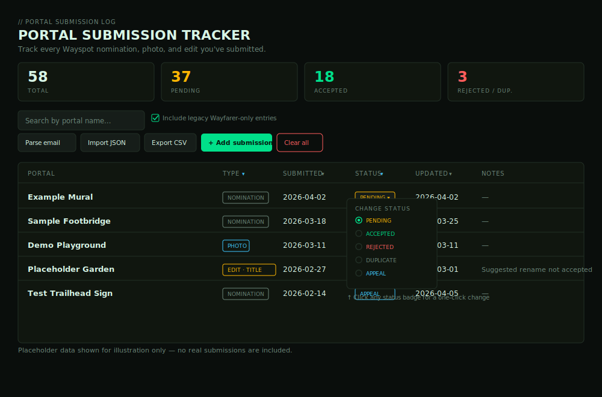
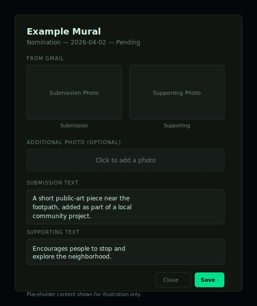

# Wayspot / Portal Submission Tracker

Track every Niantic Wayspot (or Ingress portal) nomination you've submitted — what you wrote, the photos you attached, and whether it's Pending, Accepted, or Rejected — in one private, local web app.

Two pieces work together:

1. **`gmail_wayspot_export.py`** — a script that reads your own Gmail and pulls out every nomination email into a single JSON file.
2. **`portal-submission-tracker.html`** — a standalone web app that displays, edits, and tracks that data.

Nothing here talks to Niantic directly, and nothing leaves your computer except the one-time login to your own Google account.

## Screenshots

*(Illustrative mockups with placeholder data only — no real submissions shown.)*

**Overview table** — search, filter, sort, and status counts at a glance:



**Detail view** — submission text, supporting text, and both photos pulled from Gmail, plus an optional manual photo:



---

## Part 1 — Export your data from Gmail

### One-time setup

You need your own Google Cloud OAuth credentials. This is a Google requirement for any app that reads Gmail — there's no way around this step, but it only takes a few minutes and you only do it once.

1. **Install the Python dependencies:**
   ```
   pip install -r requirements.txt
   ```
   (If you'd rather install them one by one: `pip install google-api-python-client google-auth-httplib2 google-auth-oauthlib beautifulsoup4`)

2. **Create a Google Cloud project:**
   - Go to [console.cloud.google.com](https://console.cloud.google.com/)
   - Click the project dropdown at the top → **New Project** → give it any name (e.g. "Wayspot Tracker") → Create

3. **Enable the Gmail API:**
   - In the search bar, type "Gmail API" → open it → click **Enable**

4. **Set up the OAuth consent screen:**
   - Go to **APIs & Services → OAuth consent screen**
   - Choose **External** (unless you have a Google Workspace account) → Create
   - Fill in an app name, your email as the support email, and your email again under developer contact → Save and continue through the remaining steps
   - Under **Test users**, add your own Gmail address — this lets you use the app while it's unverified

5. **Create OAuth credentials:**
   - Go to **APIs & Services → Credentials → Create Credentials → OAuth client ID**
   - Application type: **Desktop app** → Create
   - Click the download icon next to the new credential → save the file
   - Rename the downloaded file to exactly `credentials.json` and put it in the same folder as `gmail_wayspot_export.py`

### Running the script

```
python gmail_wayspot_export.py
```

- The first time you run it, a browser window opens asking you to log in and approve **read-only** Gmail access. The script cannot send, delete, or modify anything.
- A `token.json` file is saved afterward so you won't have to log in again next time.
- It searches for:
  - `"Niantic Spatial Wayspot nomination received for"` — your submissions
  - `"Decision on you Recon Nomination"` / `"Niantic Spatial Wayspot nomination decided for"` — the outcomes
- It prints progress as it goes, then writes **`wayspot_submissions.json`** in the same folder.

Re-run it anytime to pick up new submissions or decisions — the tracker's import step below is smart about merging updates.

### If something goes wrong

| Error | Fix |
|---|---|
| `FileNotFoundError: credentials.json` | You haven't completed step 5 above, or the file isn't named/placed correctly. |
| Browser says "app isn't verified" | Click **Advanced → Go to [app name] (unsafe)**. This is normal for a personal script only you use — you added yourself as a test user in step 4. |
| `403` or `access_denied` | Make sure you added your own email under **Test users** in the OAuth consent screen. |
| No results found | Double-check the emails are actually in Gmail (not archived to a different account) and that the subject lines match — Niantic may have changed wording since this was written. |

---

## Part 2 — The tracker web app

Open **`portal-submission-tracker.html`** in any browser (just double-click it, no server needed).

### Getting your data in
Click **Import JSON** and select your `wayspot_submissions.json`. This is a merge, not a wipe:
- New portals are added
- Existing ones (matched by name + submission date) get their status/text/photos refreshed
- Your own notes and any manually-attached photos are left alone

Re-import anytime after re-running the script to bring in new decisions.

### What you can do
- **Click any portal name** to open its detail view — submission text, supporting text, and both photos (submission + supporting), each clickable for a full-size view
- **Add / Edit / Delete** entries by hand
- **Parse email** — paste a single confirmation email's text to auto-fill a new entry, if you'd rather not use the Python script for a one-off
- **Search and filter** by status, **sort** any column
- **Export CSV** for a spreadsheet-friendly copy of everything
- Attach your own photo to any entry (separate from the ones pulled from Gmail)

### Privacy
All data is stored locally to this file/browser — nothing is sent to any server. The photo URLs point to Google's own image hosting (the same links from your emails), so viewing them does briefly contact Google's servers, same as opening the original email would.

---

## Files in this handoff

| File | Purpose |
|---|---|
| `gmail_wayspot_export.py` | Reads your Gmail, writes `wayspot_submissions.json` |
| `requirements.txt` | Python dependencies for the export script |
| `portal-submission-tracker.html` | The tracker app itself |
| `screenshot-overview.svg` / `screenshot-detail.svg` | Placeholder screenshots used in this README |
| `README.md` | This file |

You'll also end up with `credentials.json` and `token.json` after setup — keep those private, they're tied to your Google account.
