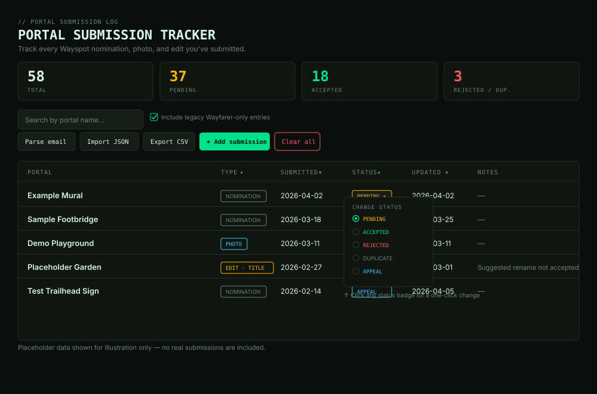
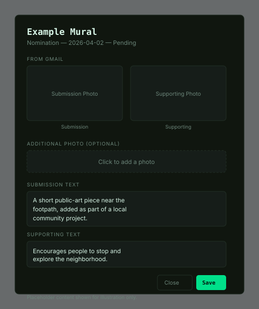

# Wayspot / Portal Submission Tracker

Track every Niantic Wayspot (or Ingress portal) nomination you've submitted — what you wrote, the photos you attached, and whether it's Pending, Accepted, or Rejected — in one private, local web app.

Two pieces work together:

1. **`gmail_wayspot_export.py`** — a script that reads your own Gmail and pulls out every nomination email into a single JSON file.
2. **`portal-submission-tracker.html`** — a standalone web app that displays, edits, and tracks that data.

Nothing here talks to Niantic directly, and nothing leaves your computer except the one-time login to your own Google account.

## Screenshots

*(Illustrative mockups with placeholder data only — no real submissions shown.)*

**Overview table** — search, filter, sort, and status counts at a glance:



**Detail view** — submission text, supporting text, and both photos pulled from Gmail, plus an optional manual photo:



---

## Part 1 — Export your data from Gmail

### One-time setup

You need your own Google Cloud OAuth credentials. This is a Google requirement for any app that reads Gmail — there's no way around this step, but it only takes a few minutes and you only do it once.

1. **Install the Python dependencies:**
   ```
   pip install -r requirements.txt
   ```
   (If you'd rather install them one by one: `pip install google-api-python-client google-auth-httplib2 google-auth-oauthlib beautifulsoup4`)

2. **Create a Google Cloud project:**
   - Go to [console.cloud.google.com](https://console.cloud.google.com/)
   - Click the project dropdown at the top → **New Project** → give it any name (e.g. "Wayspot Tracker") → Create

3. **Enable the Gmail API:**
   - In the search bar, type "Gmail API" → open it → click **Enable**

4. **Set up the OAuth consent screen:**
   - Go to **APIs & Services → OAuth consent screen**
   - Choose **External** (unless you have a Google Workspace account) → Create
   - Fill in an app name, your email as the support email, and your email again under developer contact → Save and continue through the remaining steps
   - Under **Test users**, add your own Gmail address — this lets you use the app while it's unverified

5. **Create OAuth credentials:**
   - Go to **APIs & Services → Credentials → Create Credentials → OAuth client ID**
   - Application type: **Desktop app** → Create
   - Click the download icon next to the new credential → save the file
   - Rename the downloaded file to exactly `credentials.json` and put it in the same folder as `gmail_wayspot_export.py`

### Running the script

```
python gmail_wayspot_export.py
```

- The first time you run it, a browser window opens asking you to log in and approve **read-only** Gmail access. The script cannot send, delete, or modify anything.
- A `token.json` file is saved afterward so you won't have to log in again next time.
- It searches for:
  - `"Niantic Spatial Wayspot nomination received for"` — new Wayspot nominations, plus their decisions
  - `"Thanks! Niantic Wayspot nomination received for"` (no "Spatial") — the same, but from before Niantic's Wayfarer→Spatial rebrand, plus their decisions
  - `"Thanks! Niantic Spatial Wayspot Photo received for"` — photos added to *existing* Wayspots, plus their decisions
  - `"Thanks! Niantic Spatial Wayspot edit suggestion received for"` — title/description/location edits suggested for an existing Wayspot, plus their decisions
  - `"Thanks! Niantic Spatial Wayspot appeal received"` / `"...title edit appeal received for"` — appeals of a rejected nomination, photo, or edit
- Note: Niantic's photo-submission confirmation emails don't include any text or the photo itself (unlike nominations, which include both) — so those entries will only have a portal name, date, and eventual status.
- **Coordinates**: the legacy Wayfarer emails include a `(lat, lng)` pair that the newer Spatial emails don't (confirmed by checking a real Spatial email, not assumed). These are captured automatically for Wayfarer-era nominations. For everything else — Spatial nominations, photos, edits, or anything from before this feature existed — coordinates can be filled in by hand in the app.
- Edit suggestions include the existing value and your suggested replacement, tagged with which field was edited (Title / Description / Location / etc).
- **Appeals aren't a new row** — an appeal email references the original submission by name and date, so the script finds that entry and flips its status to `Appeal` instead of duplicating it. If it can't find a confident match, it adds the appeal as its own row instead of silently dropping it, with a note flagging it for manual review.
- ⚠️ **Known limitation:** the *decided*-appeal email subject (`"Your Niantic Spatial Wayspot appeal has been decided"`) is a best guess — no real example was available while building this. If your appeal statuses don't update correctly after a decision comes in, open one of those emails, compare it against `parse_appeal_decision()` in the script, and adjust the parsing to match the real wording.
- **Old and new nomination emails are merged, not duplicated.** Niantic's nomination system has gone through three eras — OPR (`nominations@portals.ingress.com`, the original Ingress portal review system), Wayfarer, and now Spatial/Recon — and this script merges all three: Spatial data wins when more than one exists for the same portal+date, legacy-only nominations from either older era are still included, and whichever decision email is chronologically the most recent wins the final status (sometimes a portal was accepted under an older system and later rejected under a newer one after a re-review).
- **OPR is the simplest era**: one description paragraph (no separate "supporting text"), one photo, no coordinates. Its decision emails also use different wording than the other two ("Excellent work, Agent... eligible Portal nomination" rather than "Congratulations... accepted") — confirmed against real emails before building this, since guessing wrong here would have silently misclassified every OPR-era acceptance.
- **Renamed portals are reconciled, not lost.** If a nomination's title was changed via an accepted title-edit suggestion before its final decision arrived, Niantic's decision email can reference the *new* name — which won't match the original submission by name alone. The script builds a map of every accepted title edit and retries any decision that didn't match directly against it, so the right nomination still gets updated. If a decision genuinely can't be matched even after that (shouldn't normally happen), it's added as its own flagged row instead of silently dropped, and the script prints a clear summary either way — either "All decision emails were successfully matched" or a list of exactly which ones weren't, so you always know the full accept/reject picture is reflected somewhere.
- It prints progress as it goes, then writes **`wayspot_submissions.json`** in the same folder, shaped as `{ "exported_at": "...", "submissions": [...] }` — the timestamp lets the tracker show when your Gmail data was actually last fetched, not just when you happened to click Import. (Older plain-array exports from before this change still import fine.)
- **Incremental sync**: after the first run, it only fetches messages newer than the last run (tracked in a small `sync_state.json` file, with a 1-day safety buffer) and merges them into your existing data — so re-running weekly to catch new decisions takes seconds instead of re-scanning your whole mailbox. This applies to decision/appeal emails too, so a decision arriving for a nomination from months ago still gets applied correctly to that old entry. Delete `sync_state.json` if you ever want to force a full re-sync from scratch (e.g. after this script gets a parsing fix).

Re-run it anytime to pick up new submissions or decisions — the tracker's import step below is smart about merging updates.

### If something goes wrong

| Error | Fix |
|---|---|
| `FileNotFoundError: credentials.json` | You haven't completed step 5 above, or the file isn't named/placed correctly. |
| Browser says "app isn't verified" | Click **Advanced → Go to [app name] (unsafe)**. This is normal for a personal script only you use — you added yourself as a test user in step 4. |
| `403` or `access_denied` | Make sure you added your own email under **Test users** in the OAuth consent screen. |
| `RefreshError: invalid_grant` | Your saved login expired or was revoked. The script now handles this automatically (opens a fresh login instead of crashing) — if you're on an older copy, just delete `token.json` and run again. This is *expected to happen roughly every 7 days* as long as the OAuth app stays in Google's "Testing" status, since Google expires refresh tokens for unverified apps on that schedule — not a bug you need to fix, just re-log-in when it happens. |
| No results found | Double-check the emails are actually in Gmail (not archived to a different account) and that the subject lines match — Niantic may have changed wording since this was written. |

---

## Part 2 — The tracker web app

Open **`portal-submission-tracker.html`** in any browser (just double-click it, no server needed).

### Getting your data in
Click **Import JSON** and select your `wayspot_submissions.json`. This is a merge, not a wipe:
- New portals are added
- Existing ones (matched by name + submission date) get their status/text/photos refreshed
- Your own notes and any manually-attached photos are left alone

Re-import anytime after re-running the script to bring in new decisions.

### What you can do
- **Click any portal name** to open its detail view — submission text, supporting text, and both photos (submission + supporting), each clickable for a full-size view
- Each entry is tagged **Nomination**, **Photo** (a photo added to an existing Wayspot), or **Edit** (a suggested title/description/location change) — sortable by that column too
- **Add / Edit / Delete** entries by hand
- **Click any status badge** for a one-click status change (Pending/Accepted/Rejected/Duplicate/Appeal), without opening the full edit form
- **Parse email** — paste a single confirmation email's text to auto-fill a new entry, if you'd rather not use the Python script for a one-off
- **Search, filter, and sort** — click any column label to sort; click the ▾ next to Type, Status, Submitted, or Last Updated to filter by a checklist of values (Type/Status) or a date range with quick presets like "Last 30 days" (Submitted/Last Updated)
- A checkbox toggles whether **legacy Wayfarer-only nominations** (ones with no Spatial-branded counterpart, from before Niantic's rebrand) are shown — on by default, so nothing's hidden unless you choose to
- **Export CSV** for a spreadsheet-friendly copy of everything
- Attach your own photo to any entry (separate from the ones pulled from Gmail)
- **"Gmail data last synced"** shown right under the header, using the export script's own timestamp — turns amber if it's been over 30 days
- **Coordinates** — auto-filled for legacy Wayfarer nominations; editable by hand for anything else, with a "View on map" link that appears once both fields are filled
- **Clear all** — wipes every entry (with a confirmation first), if you want to start fresh

### Privacy
All data is stored locally to this file/browser — nothing is sent to any server. The photo URLs point to Google's own image hosting (the same links from your emails), so viewing them does briefly contact Google's servers, same as opening the original email would.

---

## Files in this handoff

| File | Purpose |
|---|---|
| `gmail_wayspot_export.py` | Reads your Gmail, writes `wayspot_submissions.json` |
| `requirements.txt` | Python dependencies for the export script |
| `sync_state.json` | Created automatically after your first run — tracks incremental sync progress. Delete to force a full re-sync. |
| `portal-submission-tracker.html` | The tracker app itself |
| `screenshot-overview.svg` / `screenshot-detail.svg` | Placeholder screenshots used in this README |
| `README.md` | This file |

You'll also end up with `credentials.json` and `token.json` after setup — keep those private, they're tied to your Google account.
